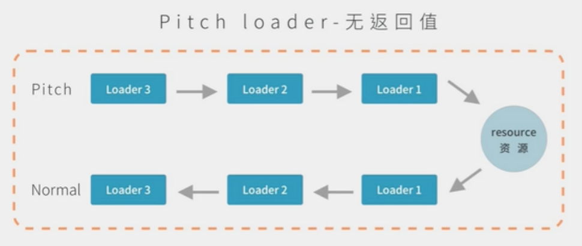
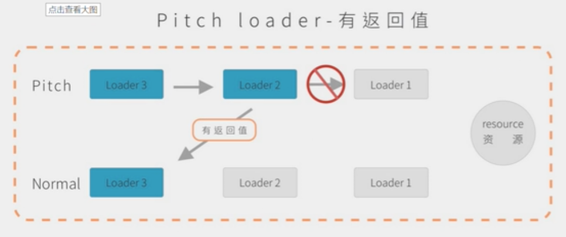

### 初始化

npm i

### 打包

npx webpack

### loader 配置方式

第 1 种方式, 绝对路径

```
module: {
  rules: [
    {
      test: /\.js$/,
      use: path.resolve(__dirname, "loaders", "loader1.js")
    }
  ]
}
```

第 2 种方式, 别名

```
resolveLoader: {
  alias: {
    loader1: path.resolve(__dirname, "loaders", "loader1.js")
  }
},
module: {
  rules: [
    {
      test: /\.js$/,
      use: "loader1"
    }
  ]
}
```

第 2 种方式, 模块

```
resolveLoader: {
  // 先在 node_modules 里面找, 找不到再去 loaders 目录下找
  modules: ["node_modules", path.resolve(__dirname, "loaders")]
},
module: {
  rules: [
    {
      test: /\.js$/,
      use: "loader1"
    }
  ]
}
```

### loader 执行顺序

从右到左, 执行顺序为: loader1, loader2, loader3

```
module: {
  rules: [
    // 从右到左
    {
      test: /\.js$/,
      use: ["loader3", "loader2", "loader1"]
    }
  ]
}
```

从下到上, 执行顺序为: loader1, loader2, loader3

```
module: {
  rules: [
    // 从下到上
    {
      test: /\.js$/,
      use: "loader3"
    },
    {
      test: /\.js$/,
      use: "loader2"
    },
    {
      test: /\.js$/,
      use: "loader1"
    }
  ]
}
```

### loader 分类

前面, enforce: "pre"
正常, 不需要配置
后面, enforce: "post"
执行顺序为: loader1, loader2, loader3

```
module: {
  rules: [
    // 强制设置顺序
    {
      test: /\.js$/,
      use: "loader1",
      enforce: "pre"
    },
    {
      test: /\.js$/,
      use: "loader2"
    },
    {
      test: /\.js$/,
      use: "loader3",
      enforce: "post"
    }
  ]
}
```

### loader 行内

loader 执行顺序: pre + normal + inline + post

### loader 组成

loader 默认有两部分组成 pitch + normal

use: ["loader3", "loader2", "loader1"]




